# UPDATES

A log of project progress and specific lessons learned.

## Milestones

- [ ] **Mercury** ⚪: A 3D block environment within Unity's GUI that can read a JSON file to display an arrangement of blocks of predefined sizes.
  - [X] Define block types
  - [X] Read JSON file to display blocks
  - [X] Write a JSON file based on block modifications in Unity
  - [ ] Visualize RL training results
- [ ] **Venus** 🟠: A labeled dataset of 3D models of object that are built with blocks of predefined sizes
  - [X] Look into ShapeNet (got access on HuggingFace!)
  - [ ] Generate single 3D object using ShapeNet and a DQN RL Block Laying Agent
  - [ ] Compare different DQN architectures
  - [ ] Explore other RL and neural network architectures
  - [ ] Generate for multiple object classes
- [ ] **Earth** 🌍: A trained Block Laying Agent
  - [ ] Continue training Block Laying Agent with changing object model targets every episode
- [ ] **Moon** 🌕: Revisit overall approach. Is RL a necessary part of this approach?
  - [ ] Consider supervised learning approaches that generate blocks of predefined sizes to match a given object voxel model in a single shot. 
- [ ] **Mars** 🔴: Build a standalone 3D block environment app
  - [ ] UX Wireframe
  - [ ] User Interaction Functions
  - [ ] Build and user tests
- [ ] **Jupiter** 🔴: Use trained Block Laying Agent to pre-train Object Recognition RL Agent
- [ ] **Saturn** 🪐: Connect AI Agents to 3D block app
  - [ ] Convert JSON file to a format for the machine learning models to use
- [ ] **Uranus** 🔵: Local user testing
- [ ] **Neptune** 🔵: Deploy the 3D block app to the web
- [ ] **Pluto** 🪨: Build a spaceship and explore the universe

## Log

### 2025-11-06

OK found another bug...

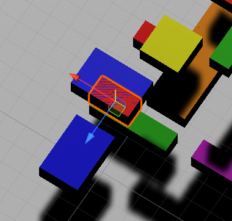

...and fixed it. 

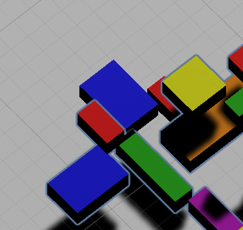

Again, the issue was in the `convertToUnityPosition()` function in  `VizResults.cs` and `VizEpisode.cs`

```
if (blockType.Equals("2x1"))
        {
            if(orient == 0)
            {
                unityPosition.x = gridPosition.x + 1;
                unityPosition.y = gridPosition.y + 0.5f;
                unityPosition.z = gridPosition.z + 0.5f; <== was -0.5f
                ...
```

But there are still overlap issues! I think at this point I've ruled out the issues with visualizing results in Unity, which means the other bugs are in the python code in the `block-laying-agent` folder.


### 2025-10-16

First a reminder note to self:

`VizResults.cs` was written to visualize blocks step by step after pressing the right arrow key, after pressing Play
 - this visualization seems to be restricted to a single JSON file record of blocks placed

`VizEpisode.cs` was written to just conveniently visualize all blocks from all episodes after pressing Play.
 - this visualization reads all JSON files in a single folder following a filename convention.

So for starters to debug the block over lap issue, first check `VizResults.cs` block by block and at least check to see if the blocks are being shown correctly in the Unity code vs the block position orientation info in the JSON file
 - `classes_flow.drawio` shows the supposed relationship between JSON position orientation info vs Unity block position/orientation values

Basically, I have two block "grid systems": one in Python for training RL agents, one in Unity for visualizing blocks. The issue could just be how I map from Python-grid to Unity-grid and there may not be any errors with how I'm checking overlapping blocks in Python-grid...I hope

Using `VizResults.cs` I went through block by block and found the first case of two blocks overlapping in Unity.

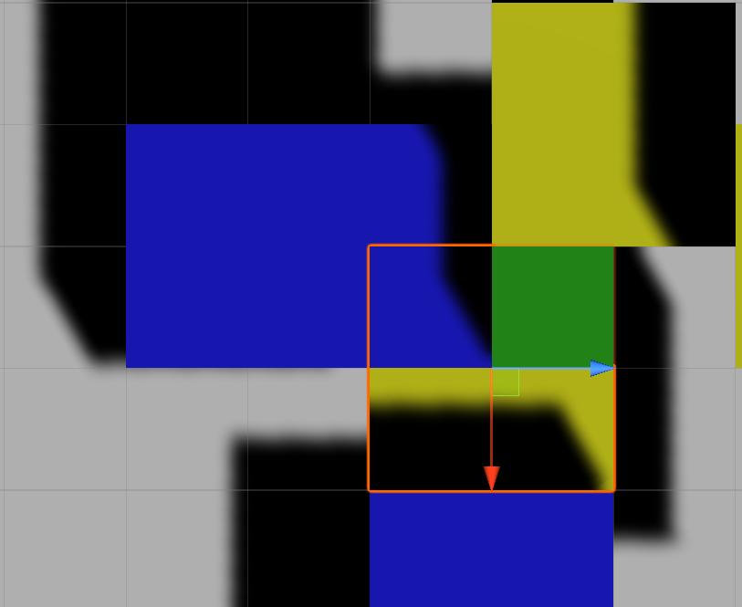

Then I used Excel to compute which grid cells the block should occupy in the Python grid system.

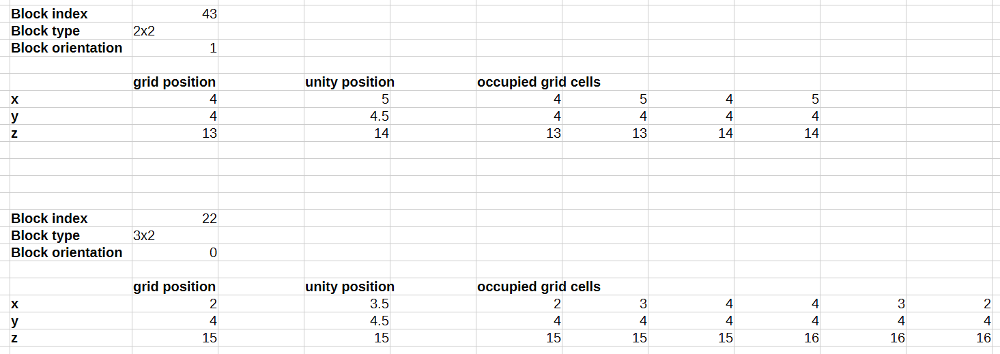

Luckily the two blocks are on the same y-coordinate, so I can also just use Excel to draw how the two blocks should be placed in Python-grid system:

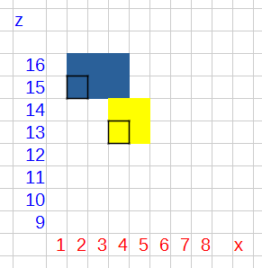

No overlap issues based on Python-grid

Then I double checked `classes_flow.drawio` and found an error!

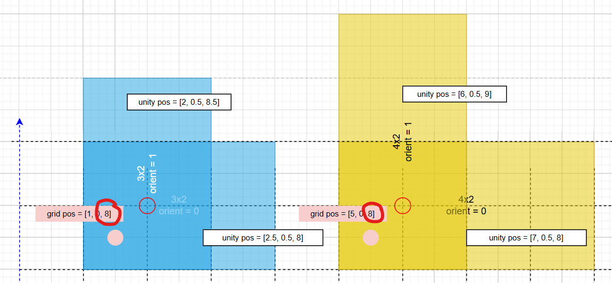

 - `classes_flow.drawio` showed incorrect Python grid position values!
 - Block types 3x2 and 4x2 were affected where Python grid z-position is off by one!
 - This should affect only how Unity displays the blocks, not how block conflicts are checked in Python scripts.

So I updated the `convertToUnityPosition()` function in `VizResults.cs` and checked the same two blocks...

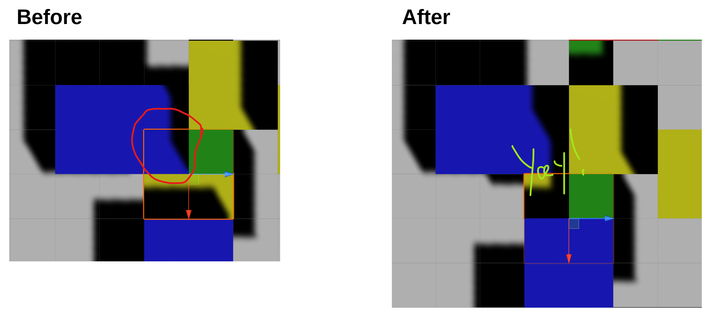

Bug fixed! 

...or so I thought.

I also updated the `convertToUnityPosition()` function in `VizEpisode.cs` then generated an entire episode's blocks, hoping to not see any block overlaps:

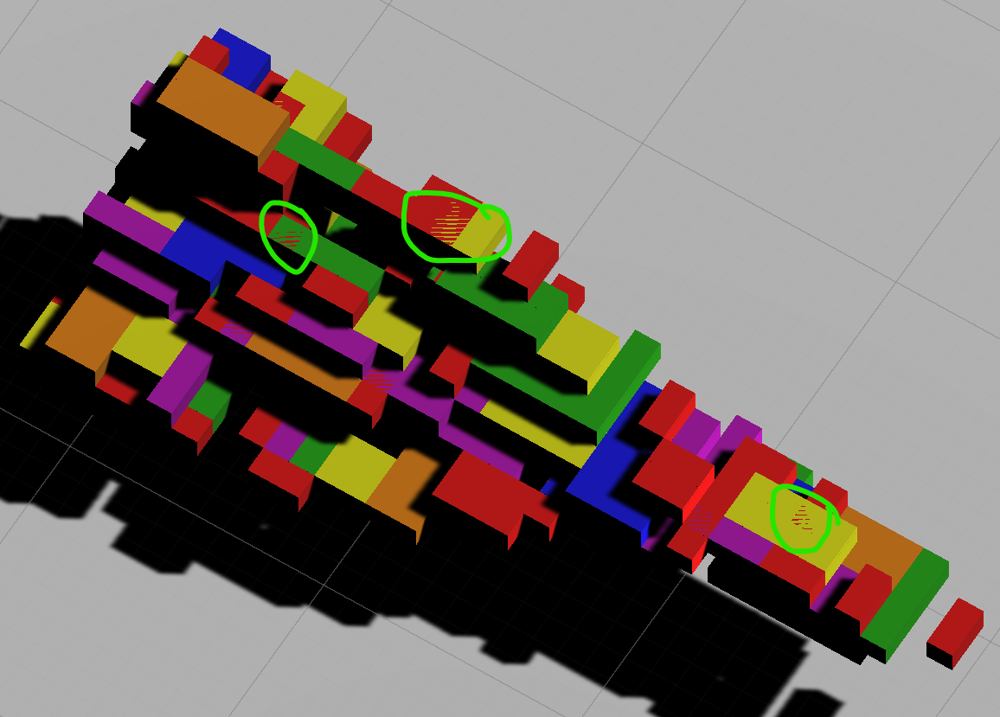

Alas, the bug still persists.

Will circle back to this maybe next week but some final thoughts:
 - double check the rest of `classes_flow.drawio` make sure all Python-grid vs Unity-grid position mappings make sense.
 - writing a modified version of `VizEpisode.cs` that stops when Unity detects box collisions could be useful...but also an over-engineered solution for debugging purposes.
 - so for now, it may still be best to go back to playing `VizResults.cs` and going step by step.

### 2025-10-09

Since it has been awhile since I first wrote the code for reading binvox files from ShapeNet dataset and scaling down voxel models, I thought I should review the code and write back out the pseudo-code for scaling down voxel models.

```
s = scale_factor # ≥1

# original model checker
x = y = z = 0

# scaled model filler
sx = sy = sz = 0

fill_threshold = 3 # ≥1

# x = sx = 0
while x < width:
	y = sy = 0
	while y < height:
		z = zy = 0
		while z < depth:
			# based on scale_factor
			# check small chunk of the voxel model
			scan_chunk = model[x:x+s,y:y+s,z:z+s]
			
			# count the number of solid cubes inside the sub-volume
			cube_count = sum(scan_chunk)
			
			# if the number of solid cubes is great than or equal to fill_threshold
			# scaled_model gets a cube filled at (sx, sy, sz)
			if cube_count >= 3:
				scaled_model[sx,sy,sz] = 1
			
			# advance original model checker to next chunk
			z += s
			# advance scaled model filler next voxel space
			sz += 1
		y += s
		sy += 1
	x +=s
	sx += 1
```

I have not researched how others have scaled down voxel models in the past but so far based on some quick tests on two different models, the above method seems to work very well for different values of `scale_factor`:

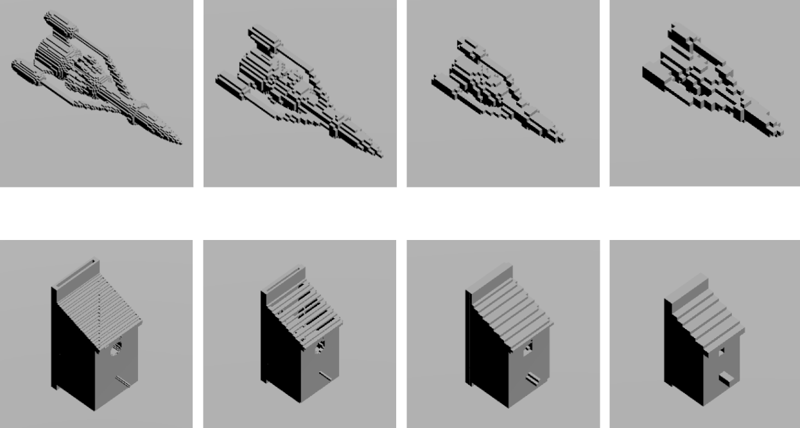

The left-most images are original scale voxel models from ShapeNet, followed by scaling down by factors 2, 3, and 4 as you look from left to right (different camera zooms, but to help judge 3D scale, just know that all models are made with unit cubes of the same size in Unity).

Judging by the Birdhouse model, scaling down a model by a factor of 4 is the most I should do. At that scale factor, the original hole in the birdhouse is the size of a 2x2 unit cubes. So increasing scale factor greater than 4 will likely "destroy" this notable feature of the birdhouse.

So moving forward, I'll make sure to train the RL agent with scaled down models first, at a scale factor of 4. 

Things to note for future reference:

 - Original ShapeNet model bounding box: `(128, 128, 128)`
 - `scale_factor=2` bounding box: `( 64,  64,  64)`
 - `scale_factor=3` bounding box: `( 43,  43,  43)`
 - `scale_factor=4` bounding box: `( 32,  32,  32)`

Calling it a night with some progress on debugging the block overlap bug. The bug still persists but a couple things are clear:

 - The current RL training environment allows an RL agent to place overlapping blocks but it receives a huge penalty / negative reward.
 - The current RL training environment then adds a block (`env_add_block()`) simulating a "perfect human builder" that knows where to place a block to help complete the 3D voxel model. 
 - `env_add_block()` has code that checks for overlap and tries a different block type, position, and orientation automatically if it detects a potential overlap.
 - To see if the block overlap bug still occurs without an RL agent, I wrote a separate "training loop" in `test_env.py` where only the environment adds blocks with RL action set to `None`.
 - Unfortunately the bug persists:

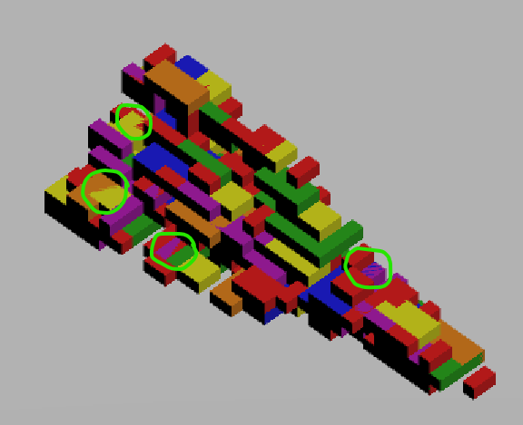


With RL agent code ignored in the above result, there remain two sources for this bug:
 - The environment isn’t checking a block overlap correctly (`env4training.py` is wrong).
 - The way the blocks are displayed in Unity is incorrect (`VisEpisode.cs` is wrong).


### 2025-09-23

Hello again world! It's been some time. I'm still getting re-situated with what I did up to the point but some initial thoughts have been stewing in the back of my mind:

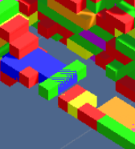

 - **Block Overlap Bug:** Back when I hastily made a visual for the project on my personal website, I noticed a few instances where two blocks were overlapping in their location.
    - What could cause this issue? One place to check is the `no_block_conflict()` function in `env4training.py`
    - Another place could be the `no_block_conflict()` function works fine but that I'm just visualizing the block location/orientations incorrectly in `VizResults.cs` and `VizEpisode.cs` in the `addBlock()` function

 - **Perfect Builder Agent:** This also presents a chance for me to start coding another idea: a "perfect builder" agent that always stacks blocks in valid locations for a given shape. 
 
 - **Scale Down Models:** The other thing I want to quickly figure out is if it's easy to scale down the voxel models even more. Right now based on a quick read of `write_json.ipynb` it seems I already scale down the ShapeNet voxel models by a factor of 2 so maybe quickly visualize models by say 3 or 4 instead.
    - The raw models are in 128x128x128 so the scaled down models might be around 64x64x64...so see what the models look like in a 32x32x32 volume.
    - This could easily turn into "well what's the best way to scale down a voxel model" but I will try to just getting one spaceship model to look OK in a smaller volume and move on.

So with a smaller ShapeNet voxel model and a "perfect builder" agent, I should be able to then visualize blocks in Unity and detect the overlapping blocks quicker to fix the bug.

### 2024-03-21

A few thoughts has occurred to me that started with the question, "Wait, why am I training the RL Agent to figure out a sequence of blocks if I just keep telling the Agent the structure of blocks is still mostly incomplete?"

If I don't have a good answer for why, then that means the target model of blocks is basically stationary, and there's no need for RL to figure out a sequence; an AI can just figure out a full structure of blocks in one shot.

Unless...the environment includes another agent that simulates how a person would stack blocks to make a given object. A couple things I'll need to incorporate:

 - The environment should add a block in a correct location and orientation based on the given shape.
 - The environment can also delete a block if it's not in a correct location.
    - 2024-05-08: On second thought this isn't a strict requirement for training something right now. Maybe eventually we can train the block laying agent with human feedback, where a human chooses to delete some blocks and causes a penalty. For now, it's not clear how an environment should automatically delete a block to simulate how a human would delete blocks in response. The current penalties for incorrect blocks may be enough to signal to the block laying agent which blocks are incorrect.
 - The reward function should really reflect whether the Agent's block was accepted or deleted by the environment.
 - The ShapeNetID should NOT be a part of the state given to the agent. It never knows the name of what's actually being built.
   - 2024-05-08: On second thought this isn't a strict requirement for training. It may help if a network assumes a target name of what it's trying to build.

Some scattered thoughts:

 - A real human doesn't make a perfect structure of blocks to perfectly match an object in their mind. So while it's OK to simulate a "Perfect Block Laying Agent" eventually I'll have to introduce noise.
 - How do people build stuff with blocks? Is it always starting at some corner? Or some other approaches?
 - Furthermore, I need to think more carefully about why RL is needed for the block laying agent. Essentially, the Agent has to learn through interactions with another agent.
 - Right now I keep things simple. Agent lays one block, Environment either lays a block OR deletes the block. But eventually I need the Agent to lay a sequence of blocks and the Environment to respond with a sequence of additional blocks and deletions.
 - I think a latent variable model can be useful here, where the latent variable can represent the Agent's guess at what object is being built and inform the rest of its predictions on what blocks to place next.
 - Another thought on how the neural network should be structured: One part (i.e., "block sequencer") takes in a sequence of blocks already laid out and deleted, and outputs a new sequence of blocks. Another part (i.e., "3D processor") takes in the current grid of cells and unoccupied cells and encodes it to condition the predictions of the "block sequencer" (i.e. like the cross attention part of a transformer).


### 2024-03-16

Who would've known CUDA could run out of memory?

The [PyTorch DQN tutorial](https://pytorch.org/tutorials/intermediate/reinforcement_q_learning.html) code moves `(state, action, next_state, reward)` to the CUDA device before pushing to ReplayMemory.

This seems like a major mistake. States can be quite huge to begin with, and they pushing the states to ReplayMemory mean they will accumulate on the CUDA device. One can at least move those tensors to cpu and detach+clone them on ReplayMemory. Only a batch of those tensors sampled from ReplayMemory need to be moved to CUDA device during the `optimize_model()` step.

Eventually, I may also need to lower the ReplayMemory capacity from 10000 to 1000 or even lower. Right now I ran training for 1000 blocks in a single episode. Storing that ReplayMemory as a part of my checkpoint file, I end up with a compressed tar file of **14GB**. I'm betting much of that is due to the ReplayMemory storing all those Transitions.

This does seem like the most important tradeoff to investigate in DRL - memory vs learning performance.

### 2024-03-16

[PyTorch DQN tutorial](https://pytorch.org/tutorials/intermediate/reinforcement_q_learning.html) assumes that the next state's value = 0 when the episode/environment terminates:

```
"""agent.py"""
# Compute V(s_{t+1}) for all next states.
# Expected values of actions for non_final_next_states are computed based
# on the "older" target_net; selecting their best reward with max(1).values
# This is merged based on the mask, such that we'll have either the expected
# state value or 0 in case the state was final.
next_state_values = torch.zeros((BATCH_SIZE,5), device=device)
```

At first I read that and thought, "Are terminal states associated with reward = 0? If so, shouldn't it be whatever the final reward was?"

Then I saw how next state was used:

```
# Compute the expected Q values
expected_state_action_values = (next_state_values * GAMMA) + reward_batch.unsqueeze(1)
```

It's not that we're assuming the reward is 0 for next state. We're assuming that the value of next state beyond a terminated episode is 0. When the next state value=0, the expected Q-values therefore only get updated with the actual reward at the end of the episode, not a reward=0.

Another major update: The environment state reflects both what cells are unfilled and what cells need to be filled based on the target object's voxel model.

So the state is initialized with values of -1 to represent empty cell, but substracts further at cells where there's supposed to be something filled.

```
"""environment.py"""
self.state[2:5,:,:,:] = self.state[2:5,:,:,:] - 9 * self.target_vox_tensor` # x,y,z values only
```

So at a grid cell where there's supposed to be a block, the initial state will look like

```
tensor([2843684,      -1,     -10,     -10,     -10,      -1,      -1])

# Instead of:
# tensor([2843684,      -1,      -1,      -1,      -1,      -1,      -1])
```

### 2024-03-14

Got a Deep Q-learning Network to start figuring out how to place blocks to match a shape!

First, I had to carefully think about how blocks rotate and how that affects the cells they occupy in a tensor and their position in Unity. I'm assuming each of the 6 types of blocks has only two types of rotations that an agent can choose from. This informs both the action space for the agent/environment and how the environment handles the agent's choice of action.

Currently the DQN agent can choose among 6 block types, 2 orientations to place in a 64x64x64 grid. That amounts to over 3 million possible actions. Of course, once the DQN agent places a block on the grid, it cannot place a block in that same location or other nearby blocks that overlap with it. The current environment penalizes the agent when it places a block that overlaps with other existing blocks, and the state of the blocks remains unchanged.

I started by modifying example code in the [PyTorch DQN tutorial](https://pytorch.org/tutorials/intermediate/reinforcement_q_learning.html). My thinking was "Well MY DQN agent is picking indices between 0 and 5, then 0 and 1, and then 0 and 63..." such that `agent.select_action()` returns an array of indices (i.e., `[5, 1, 34, 32, 58]`).

But each iteration ended up taking a lot of time. Addressing the computational efficiency, especially in the `optimize_model` function, I ended up basically doing what the tutorial did. With large and high dimensional action spaces, the approach of having the agent compute the indices of each dimension using `unravel_index()` (with torch 2.2 or numpy library) ends up taking a lot of time. Instead, the DQN agent can just use `torch.max(Q-values)` to get the `max_index` instead of a list of indices (i.e., `3024954` instead of `[5, 1, 34, 32, 58]`). This `max_index` specifies the location of the max Q-value if the action space were reshaped into a 1D array. As an added bonus, we can declare a single value inside a the tensor for the action and just update the value instead of declaring a new tensor every time.

```
# agent_actions = torch.tensor([[max_index]], device=device, dtype=torch.long)

agent_actions[0,0] = max_index # update the value instead
```

With the DQN agent only returning a single max_index value, the `optimize_model()` function can estimate `Q(s_t, a)` and `V(s_{t+1})` using `view()` and `gather()` functions, without having to unravel the agent's action.

```
# Q(s_t, a)
state_action_values = self.policy_net(state_batch).view(BATCH_SIZE,-1).gather(1, action_batch)

# V(s_{t+1})
self.target_net(non_final_next_states).view(BATCH_SIZE,-1).max(-1).values
```

During optimization you don't need to calculate the individual indices at each dimension of the action space. You can just reshape the action space to a 1D vector and torch.max() will then tell you where to get the max Q-value.

Of course the `unravel_index()` still needs to be used, but by the environment, not the agent.

```
"""agent.py"""
max_index = torch.max(Q_tensor) # Q_tensor.shape = (BLOCK_TYPES,NUM_ORIENTATION,NUM_X,NUM_Y,NUM_Z)

"""environment.py"""
block_type_i, orientation, grid_x, grid_y, grid_z = np.unravel_index(max_index,(BLOCK_TYPES,NUM_ORIENTATION,NUM_X,NUM_Y,NUM_Z))
```

Even with these tricks, optimizing model() can take some time because the input size and output size are huge, which means back-prop takes awhile (even with CUDA). So a single agent_action+env_step can take around 15 seconds, just to place one block before repeating the episode loop!

While I'll continue thinking about how to make this process faster from the neural network/ RL agent side of things (maybe PPO?), one thing that's sure to help is to give the surface voxel model as the agent's target, not the solid model. Fewer blocks in the target model should mean less time per episode. 

The rewards for this training environment should also account for the large amount of blank space vs filled space in the target 3D model. Maybe give a positive reward of `(1-fill_fraction)` for every block placed in a correct location and `-(1-fill_fraction)` penalty for incorrect locations...

P.S.

It's surprisingly hard to figure out what the ShapeNet folder numbers mean. https://paperswithcode.com/paper/shapenet-an-information-rich-3d-model/review/ has the complete ShapeNetCore list of object labels.

### 2024-02-25

Somehow I need to go from an input tensor of shape (7,100,100,100) (i.e., `block_info, num_x, num_y, num_z`) and generate a tensor of shape (6,2,100,100,100) (i.e., `block_types, num_orientations, num_x, num_y, num_z`) to interpret as the Block Laying Agent's action space.

The simplest architecture seems to be a single Conv3D layer with `in_channels=7` and `out_channels=12` (`block_types*num_orientations`) and `kernel_size=1` and then reshaping the resulting (12,100,100,100) tensor to (6,2,100,100,100). The nice thing is that this generates the action space "all in one shot" that hopefull the neural net "considers everything all at once" when deciding which block type to use, what orientation it has to be in and where to place it in XYZ coordinates.

But I suspect there may be better ways to do it. With respect to the architecture, adding more layers may reflect the hierarchical nature of placing blocks (i.e., "first you find the best block type then figure out where to put it..."). With respect to creating higher dimensional spaces (4D->5D tensor), there might be other ways besides reshaping an oversized 4D tensor.


### 2024-02-25

Played around with the Conv3D function. Assuming an input tensor of (7, 500, 500, 500), it takes awhile for a 3D convolution to finish given the large size and the Conv3D's stride=1. Increasing the kernel size obviously doesn't help because that just increases the amount of computations per "kernel sliding window." Increasing the stride helps reduce the number of computations but at the trade off of reducing the dimensions of the output "too much" - you may lose the complexity in the data after the convolution encodes it to lower dimensional space.

Given that these 3D convolutions can take a long time it might be worth looking at ways to reduce the necessary computations by considering which parts of the input tensor has not changed. Can PyTorch make this comparison between one tensor and a previously processed tensor and just look at the kernels that need re-calculation? The thing is, parts of the 3D grid will remain blank for some time in the initial steps when the Block Laying Agent is just starting to place blocks in a small area of the block


### 2024-02-24

Finished playing around with Conv2D function parameters. Started diagramming how Block Laying Agent could work with dataset. 

A burning question that come up is how neural nets can process multi-modal data, since the Block Laying Agent has to consider both the name of the object and the 3D data. It would be even nicer if both the existing sequence of blocks already laid out and the full 3D grid of filled and unfilled cells.

The name of the object might have to be processed as the ShapeNet ID for now, which is based on WordNet's synset offset (???). This can be easily converted to a string later once I have a dictionary mapping ShapeNet ID to the label.

For now a simple strategy regarding the input data is to "fuse" everything into a single 4D tensor, where the ShapeNet ID is copied throughout the tensor. But I'm wondering if there's a way to handle different modes of input data in their unique data formats at the beginning and then somehow "fuse" them later in the network's latent space or something. I'm betting somehow separate networks start with their own input data but then encode things into a shared latent space.

So the next step is to play around with Conv3D and see how it can work with a 4D tensor which will replicate the 3D grid of the Block Environment, but each cell in that 3D grid contains a 1D vector representation of the block that occupies that grid cell.


### 2024-01-05

Block Environment can now display voxels in Unity, but the binvox file has to be converted to a JSON file first in `voxel-tools/write_json.ipynb`. Working with a birdhouse model for now...

The large scale of the voxel models can be an issue. Right now `scale_down_factor` and `if(count_true >= 3):`  handle scaling down the voxel model. `scale_down_factor` checks if nearby cells are also filled with blocks and `count_true` decides how many total blocks are worth converting into a single blocked in the scaled down version of the voxel model. Will need to check if the same variable values work for other objec models and classes.


### 2024-12-30

Got ShapeNet files! Now I just need to figure out how to read the voxel data and visualize them with Cubes in Unity...